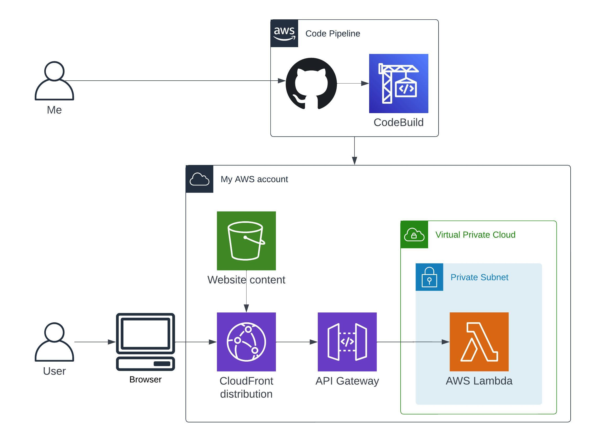

# webutils.xyz

This is a little side project to help me learn new technologies. The 
main idea is that as developers, we sometimes make google searches for
"online converter from this to that", or "list of strings to SQL in
clause". The site offers simple pages to do these things, however, the
source code remains open source for people to see how things really work.

## Architecture



At high level, once the code is pushed into the main branch, it starts a
code pipeline. The pipeline generates the HTML for the UI and puts it in the
S3 bucket, where the CloudFront distribution pick it up. The pipeline also
deploys the CDK stacks for the infrastructure and the pipeline itself (this
means it is a self mutating pipeline).

## High level overview

### Lambdas

The lambdas must be defined in a Python function [here](src/lambdas). For
them to be deployed, they also need a definition file
[here](lib/configs/lambdas). The definition file must have the fields
needed in the HTML form, the test event for the unit tests and the expected
output for the unit tests.

### UI

I am not a web developer. I know this is not pretty. There is no actual HTML,
most of it is generated on the fly by [this](src/generate_html.py) using
templates and string replacements. I'll get better over time.

## Usage

Local build and deploy to test account:

```shell
./scripts/lint.sh && npm run lint && cdk deploy --all
```
